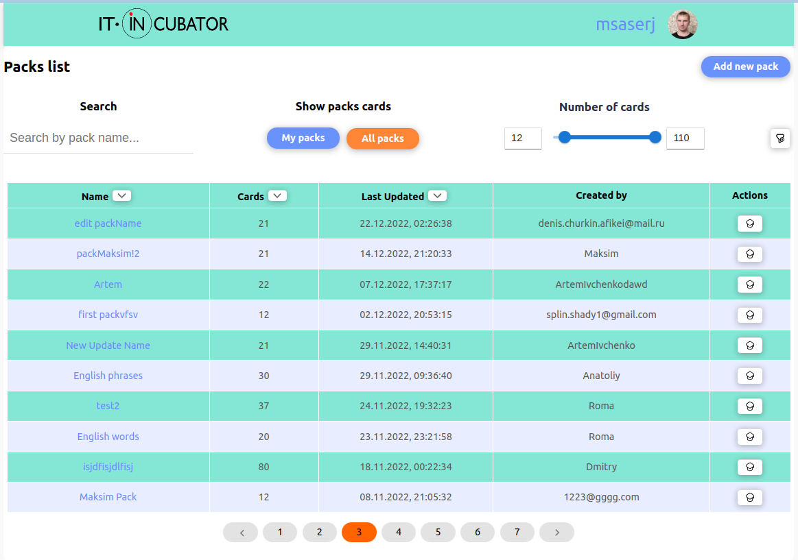

<h1 align="center">Learning by Cards</h1>
<h2 align="center">

</h2>

<p align="center">

[//]: # ()


<br/>


</p>


<h2 align="center"><a  href="https://msaserj.github.io/inc-fridayproj">Live Demo</a></h2>

[//]: # (### [Contributions are Welcome]&#40;https://github.com/silent-lad/VueSolitaire/blob/master/CONTRIBUTING.md&#41;)

## Description

**This is a tutorial project - Learning by Cards.
You can learn, for example,
foreign languages or questions and answers on the topic of your programming language using the cards of other users.
You can also create your own cards and decks.**

<p align="center"></p>

## About the project.

What is implemented here?

1. Registration process. Forms of registration, authorization, password recovery.
2. Viewing, searching, sorting decks and user cards by the number of cards in the deck
using range slider and debounce.
3. CRUD operations for user cards and decks.
4. Viewing the user's profile, a form for editing your profile, the ability to change 
the profile photo.
5. Pagination
6. A small library of universal components used in the project.

You can also register and test this project.

## Technologies

**React**,
**Redux**,
**MaterialUI**,
**TS**,
**CSS**.

## Project setup

```
npm install
npm run serve
```
#### use yarn
```
yarn
yarn start
```

## Future scope

- Add documentation for components such as StoryBook.
- Get rid of some materialUI components.
- Get rid of business logic errors.
- Add unit test for reducers
- Add some options for users.

## My Home Page

[Sergei Minko aka msaserj](https://msaserj.ru)


### Created by:
Sergei Minko, @msaser, site: [my home page](https://msaserj.ru)  \
AgeevDmitryMinsk, Dmitry Ageev [github.com/AgeevDmitryMinsk](https://github.com/AgeevDmitryMinsk) \
Sergei Mekhavich, @serakss [github.com/serakss](https://github.com/serakss)
